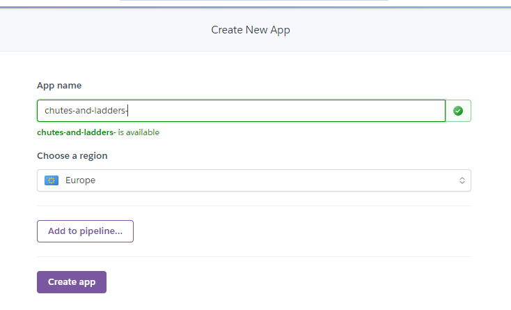
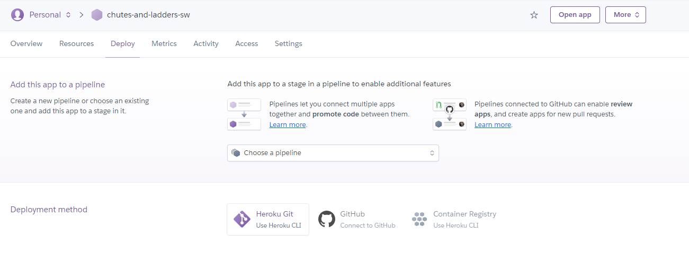
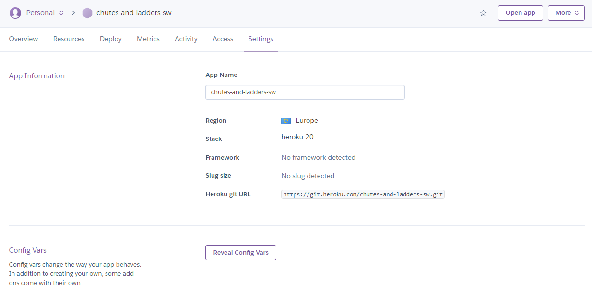
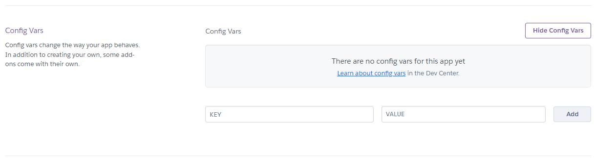
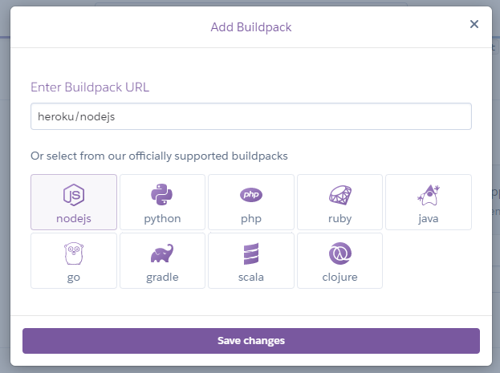
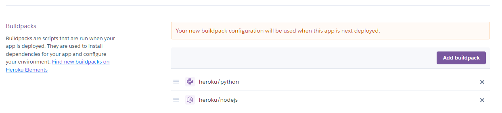
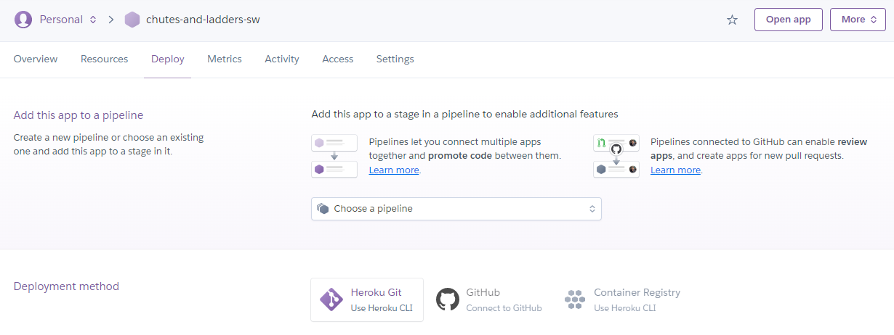
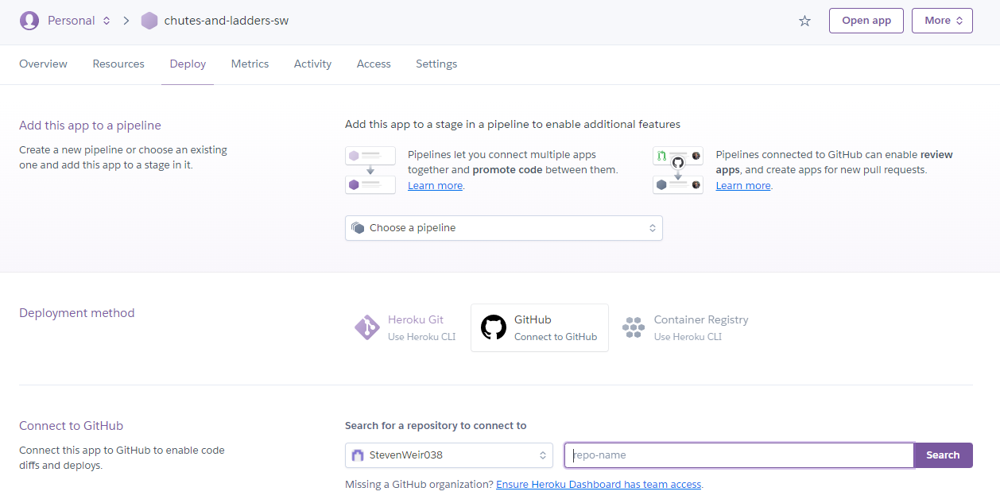
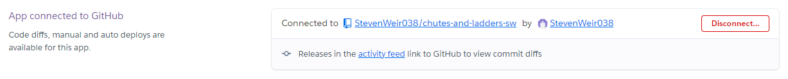

# Deployment

Code Institute provided a [template](https://github.com/Code-Institute-Org/python-essentials-template) to display the terminal view of this backend application in a modern web browser. This is to improve the accessibiltiy of the project to others.

The live deployed application can be found at [Snakes andLadders](https://snakes-and-ladders-sw.herokuapp.com/).

[Return to README.md](README.md)

## Local Deployment
*Gitpod* IDE was used to write the code for this project.

To make a local copy of this repository, you can clone the project by typing the follow into your IDE terminal:
- `git clone https://github.com/StevenWeir038/Snakes-and-Ladders.git`

Alternatively, if using Gitpod, you can click below to create your own workspace using this repository.

## Heroku
It is recommended to deploy as soon as practicible to faciliate regular testing.

This project uses [*Heroku*](https://www.heroku.com/about), a platform as a service (PaaS) that enables developers to build, run, and operate applications entirely in the cloud.

Deployment to the platform can feel complex for a first time user so do as follows after account setup:

Within your personal area select *New* in the top right corner and select *Create new app* from the drop down menu.

Give your app a name, set where you reside and then select *Create app*. For example:

In the menu of your newly created project select *Settings*.

Select *Reveal Config Vars*.

In the *Config Vars* section of the *Settings* page, expose the necessary port by setting the value of KEY to `PORT` and the value to `8000`.  

To install/support dependancies select *Add buildpack*.
The order of the buildpacks is important, select `Python` first then `Node.js` second. If they are not in this order, you can click and drag them in the buildpacks section to rearrange.

Make sure to save your changes once each pack is selected.

To deploy, scroll to the top menu and select *Deploy*.

In the *Deployment method* section of the *Deploy* page look for the *GitHub* icon and select *Connect to GitHub*.

In the *Connect to GitHub* section of the *Deploy* page type a unique repository name.  For example the name is `snakes-and-ladders-sw` as set in the Create app page.

Select *Search*.  If the repository is found select *Connect*.

