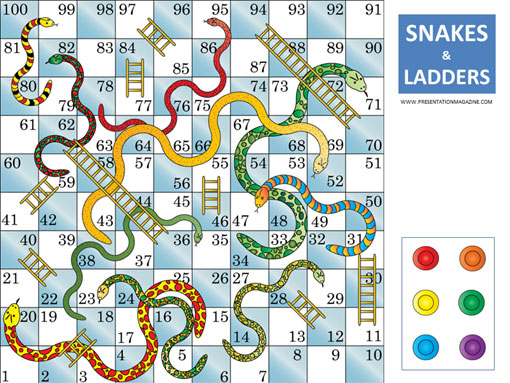
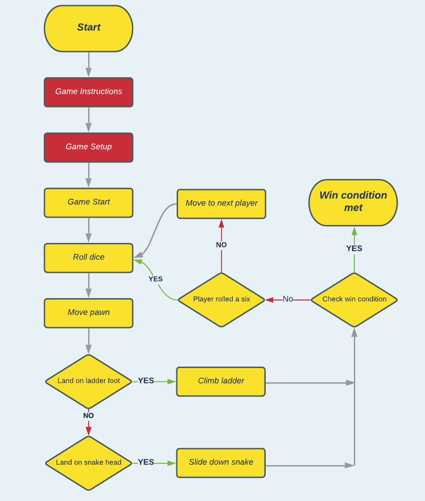

# **Snakes and Ladders**
 

## Game Rules
**Game Requirements**

- Number of players: 2-4
- Required: 1 dice (six sided), pawns (1 for each player), playing board

**Pre-game**
- Each player takes a different color pawn and throws the dice.

**Game**
- The first player throws the dice and moves their pawn according to the number shown on the dice.
- If a player's pawn lands on an empty square there is no effect.
- If a player's pawn ends its move at the foot of a ladder, the pawn must move immediately to the square at the top of that ladder.
- If a player's pawn ends it move at the head of a snake, the pawn must immediately move to the tail of that snake.
- Each time a player throws a 6, they are entitled to roll the dice and move again.

**Victory Condition**
- Be the first player to reach square *100*. 

## Game Mapping
The [game logic](docs/wireframes) diagram was created using [Lucidchart](https://www.lucidchart.com/pages/).

 

## Future Adaptations
Two additional game rules can be applied for extra complexity.  
- (Additional rule) If a player's pawn lands on a square occupied by an opponents pawn, that pawn is removed from the board and they must start again. 
- (Additional Rule) An exact throw is required to reach square 100.  If the throw exceeds 100 the player must move backwards. Watch out for the snakes!

## Approach
From the outset I sought to develop the application using an OOP paradigm.  This is used with real world aplications and supports my long term development as opposed to building something procedural.
The application is simple (for an experienced developer) but I wish to achieve a better understanding of the benefits of using OOP/classes as they lend themselves to the *Don't Repeat Yourself* principle.

## Testing
Go to [TESTING.md](TESTING.md) to view known bugs and fixes. Consider it my inner dialogue.

## Technologies Used
Python version 3.x
Additional libraries used: Colorama.
Web deployment with Heroku.

## Deployment
The site was deployed to *GitHub* pages. The steps to deploy are as follows:
- In the GitHub repository, navigate to the *Settings* tab.
- From the source section drop-down menu, select the Main Branch.
- Once the Main branch has been selected, the page will be automatically refreshed with a detailed ribbon display to indicate the successful deployment.

The live link can be found here - https://snakes-and-ladders-sw.herokuapp.com/

## Local Deployment
In order to make a local copy of this repository, you can clone the project by typing the follow into your IDE terminal:
- `git clone https://github.com/StevenWeir038/Snakes-and-Ladders.git`

Alternatively, if using Gitpod, you can click below to create your own workspace using this repository.

## Media and Content
REVIEW
### Credits
Beyond the Code Institute LMS a few key sources cemented my understanding of how to combine working with loops, dictionaries and classes. In particular, accessing their attributes and using them within loops, lists and dictionary comprehensions.

- [Abarneret](https://stackoverflow.com/a/17662224)
- [Jobel](https://stackoverflow.com/a/41720350)
- [James Gallagher](https://careerkarma.com/blog/python-convert-list-to-dictionary/)
- [schneebuzz](https://stackoverflow.com/a/59999615)

To repeat the same iteration of a loop depending on a condition.
- [David Heffernan](https://stackoverflow.com/a/7293992)

Error handling for empty and non integer values at the same time.
- [Joshua Burns](https://stackoverflow.com/a/4994509)

To clear the terminal window
- Tim Nelson via his Slack channel

### Content
Dice, snake and ladder [emojis](https://emojipedia.org/) sourced from emojipedia.

[Board image](https://www.istockphoto.com/vector/snakes-and-ladders-black-and-white-gm1066160462-285104267 "Board image") courtesy of iStock.

[SNAKE_HEAD and LADDER_FOOT dictionaries ](docs/readme/own-gameboard.png "Own Gameboard") based of a game purchased from [Ambassador Games](http://www.ambassadorgames.com/craftsman-deluxe-game-house.htm).
