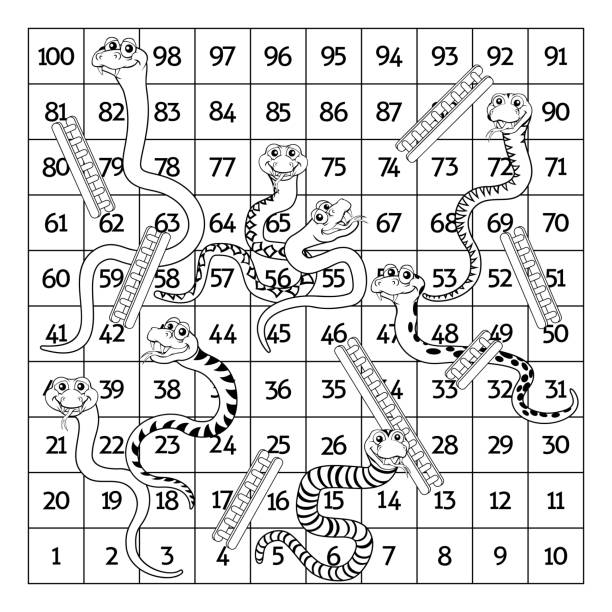

# **Snakes and Ladders**
 

## Game Rules
**Game Requirements**

- Number of players: 2-4
- Required: 1 dice (six sided), pawns (1 for each player), playing board

**Pre-game**
- Each player takes a different color pawn and throws the dice.

**Game**
- The first player throws the dice and moves their pawn according to the number shown on the dice.
- If a player's pawn lands on an empty square there is no effect.
- If a player's pawn ends its move at the foot of a ladder, the pawn must move immediately to the square at the top of that ladder.
- If a player's pawn ends it move at the head of a snake, the pawn must immediately move to the tail of that snake.
- Each time a player throws a 6, they are entitled to roll the dice and move again.
- (Additional rule) If a player's pawn lands on a square occupied by an opponents pawn, that pawn is removed from the board and they must start again. 
- (Additional Rule) An exact throw is required to reach square 100.  If the throw exceeds 100 the player must move backwards. Watch out for the snakes!

**Victory Condition**
- Be the first player to reach square *100*. 

## Game Mapping
The [game logic](docs/wireframes) diagram was created using [Lucidchart](https://www.lucidchart.com/pages/).

 

## Media and Content
REVIEW

[Emojis](https://emojipedia.org/) sourced from emojipedia.

[Board image](https://www.presentationmagazine.com/snakes-and-ladders-board-game-8031.htm "Board image") courtesy of Presentation Magazine.

[SNAKE_LADDER dictionary ](docs/readme/own-gameboard.png "Own Gameboard") based of a game purchased from [Ambassador Games](http://www.ambassadorgames.com/craftsman-deluxe-game-house.htm).
