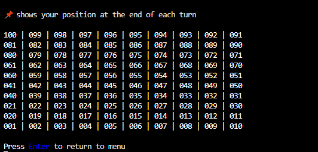

# **Snakes and Ladders**
 

Welcome to **Snakes and Ladders**, a classic boardgame enjoyed by children and adults throughout the world.

It's a game of simple logic and chance making it a suitable project to learn Python. 
I do hope you enjoy this take on the original!

## Wireframes
The game's logic was mapped out before coding began using a free version of [Lucidchart](https://www.lucidchart.com/pages/).

This web based platform is intuitive to use due to it's drag, drop and snap capabilities.

 

## Future Adaptations
Three additional game rules can be applied for extra complexity.

1. Each time a player throws a 6, they are entitled to roll the dice and move again.
2. If a player's pawn lands on a square occupied by an opponents pawn, that pawn is removed from the board and they must start again. 
3. An exact throw is required to reach square 100.  If the throw exceeds 100 the player must move backwards. Watch out for the snakes!

## Features
### Splash Screen
The game is best viewed at 1024 X 768 pixels.  No real responsiveness has been built into the browser due to the backend nature of the project.

Nonetheless, I wanted to provide a little humour to the user.

Firstly, an image conveys that the game is Snakes and Ladders.

Secondly, the `button` element in the webpage has be given a bespoke title referencing the classic `CLICKME` convention.  Since we are programming and snakes do what they do, `bite` becomes `byte`. 

 

### Main Menu
The menu is color coded to aid the user.  Options are designed to be intuitive to the user.

The user can review the game's rules in this area accessed from the main menu.

The user can review a version of the game's board accessed from the main menu.

The user is askewd if they want to quit the application.  If yes, it closed down, if no, the main menu is displayed.

## Deployment
Go to [DEPLOYMENT.md](DEPLOYMENT.md) for detailed instructions to deploy application to Heroku.

## Testing & Error handling
Extensive testing has been undertaken to provent program crashes or unintended actions.
Go to [TESTING.md](TESTING.md) to view known bugs and fixes.

## Technologies Used
Flowcharts created with [Lucidchart](https://www.lucidchart.com/pages/).

Web deployment using [Heroku](https://www.heroku.com/about).

SVG background in browser generated using [Convertio](https://convertio.co/) and edited using [Boxy](https://boxy-svg.com/).  Both were free to use.
(Note, this was nothing more than a personal/fun touch but I hope it reinforces to the user as to what game they are playing)

Python version 3.8

Additional Python libraries used:
- **os** to clear terminal window & center display
- **time** to produce time delays to user inputs
- **random** to simulate dice roll
- **colorama** to beautify display
- **termcolor** to beautify title

## Media and Content
### Credits
Thank you to my mentor [Tim Nelson](https://tim.2bn.dev/) for his candor.  Fantastic as always.

Beyond the Code Institute LMS a few key sources cemented my understanding of how to combine working with loops, dictionaries and classes. In particular, accessing their attributes and using them within loops, lists and dictionary comprehensions.

- [Abarneret](https://stackoverflow.com/a/17662224)
- [Jobel](https://stackoverflow.com/a/41720350)
- [James Gallagher](https://careerkarma.com/blog/python-convert-list-to-dictionary/)
- [schneebuzz](https://stackoverflow.com/a/59999615)

To repeat the same iteration of a loop depending on a condition.
- [David Heffernan](https://stackoverflow.com/a/7293992)

Error handling for empty and non integer values at the same time.
- [Joshua Burns](https://stackoverflow.com/a/4994509)

To replace all occurrences of an element in a nested list
- [Indhumathy Chelliah](https://betterprogramming.pub/10-important-tips-for-using-nested-lists-in-python-38ceca68be35)

To clear the terminal window.
- [poke](https://stackoverflow.com/a/2084628)

To center content on the terminal window
- [Joe Iddon](https://stackoverflow.com/a/52138950)

To display a more traditional game board layout.
- [Manish V. Panchmatia](https://stackoverflow.com/a/55241525)

And to provide the board's text/alignment some uniformity.
- [yucer](https://stackoverflow.com/q/40999973)

How to be PEP8 compliant when working with long *f-strings*
- [Danny Bullis](https://stackoverflow.com/a/69908278)

Inspiration to use a SVG background in the browser.
- [Matt Bodden](https://github.com/MattBCoding). A fellow student at the [Code Institute](https://codeinstitute.net/).  We have never met though I appreciate the quality of his content.

### Content
Emojis from Emojipedia.
- [Party horn](https://emojipedia.org/party-popper/)
- [Balloon](https://emojipedia.org/balloon/)
- [Chequered Flag](https://emojipedia.org/chequered-flag/)
- [Snake](https://emojipedia.org/snake/)
- [Paperclip](https://emojipedia.org/linked-paperclips/) (analogue was used as ladder unavailable)

[Board image](https://www.istockphoto.com/vector/snakes-and-ladders-black-and-white-gm1066160462-285104267 "Board image") courtesy of iStock.

Browser background from [Wallpaper Cave](https://wallpapercave.com/w/wp9142232). This was converted to an *svg* format to enable browser display.

[SNAKE_HEAD and LADDER_FOOT dictionaries ](docs/readme/own-gameboard.png "Own Gameboard") based of a game purchased from [Ambassador Games](http://www.ambassadorgames.com/craftsman-deluxe-game-house.htm).
