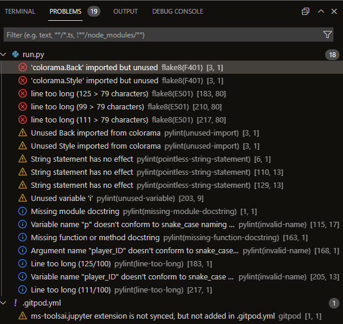
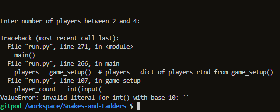
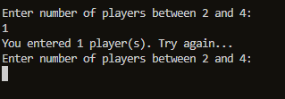
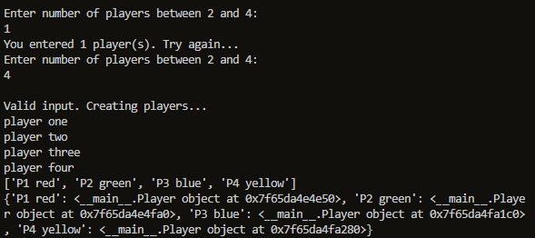
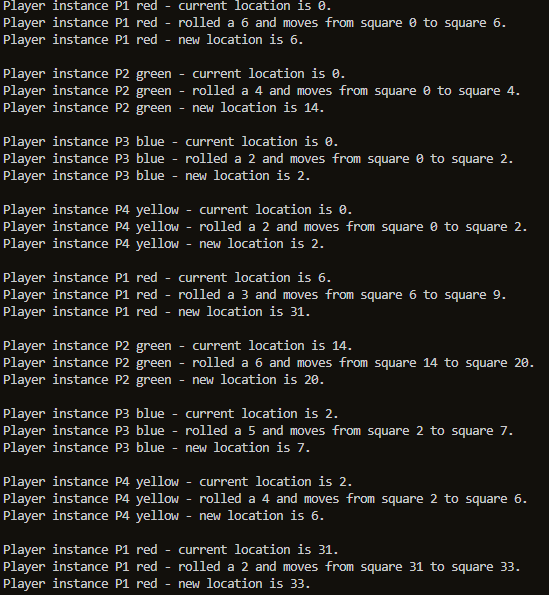
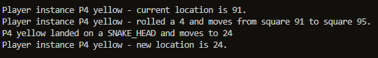
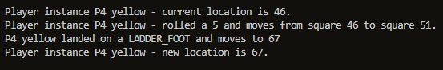
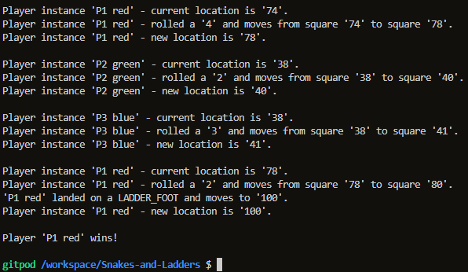
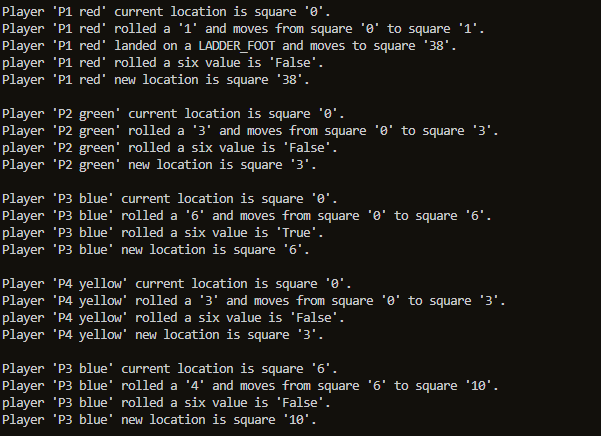
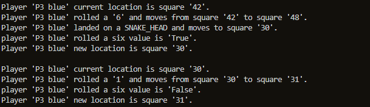

# Testing
**A student's inner voice, providing feedback of current approach/understanding to his mentor to develop improvements for future assessment.**

Using the [flowchart](docs/wireframes/flowchart.png "Game logic flowchart") as a guide, an incremental approach was used to build the application.

## IDE tools
The problems tab beside the terminal in gitpod provided warnings for code issues.  There are a few categories. Those of primary concern were highlighted red and needed to be resolved.
This was consulted every after writing several lines of code and was especially useful for resolving syntax errors and checking for unused variables.

*Terminal output*



## Game setup
### Casting
Care was taken when accepting inputs from the user.  As these defaulted to a *string* format they required converting to an *integer* format as they were to be used in a loop to create the validated number of players.

``` python
# Immediately convert string input from user to an integer
player_count = int(input("Enter number of players between 2 and 4:\n"))
```

``` python
for p in range(1, player_count + 1):
    if p == 1:
        print("player one")  # testing
        player_list.append("P1 red")
    elif p == 2:
```

An issue was found when the user doesn't enter a number and just keys *return*.  No value is passed to the application.
The application crashes as it bypasses the `validate_player_count()` function therefore preventing input from being validated.

*Terminal output*



This was resolved by placing the `input()` inside a `try` statement and using truth value testing.

``` python
try:
    # code to run regardless, it may throw an exception...
    player_count = int(input(
        "Enter number of players between 2 and 4:\n"))

    if not input:
        print(f"You entered {player_count} player(s). Try again...\n")
        ...
except ValueError as e:
# except - if an exception thrown, clear terminal and restart program
    # print(e)  # testing
    clear()    # clear terminal
    main()  # restart program
```

The associated `except` clears the terminal then restarts the program.
Note the `import` from the `os` module to build the clear_terminal function.

``` python
from os import system, name

def clear_terminal():
    """
    clear the terminal.
    """
    _ = system("cls") if name == "nt" else system("clear")
```

All the user now sees when submiting no input is an instruction to enter a value that isn't text.  It's a confidence building experience as they don't see an application crash caused by an error.

### Validating player counts
Print statements using f strings provide human readible feedback from the terminal.  This is demonstrated when the user enters a value outside the *range* of players needed for the game.

``` python
def validate_player_count(player_count):
    """
    Check number of players supplied from game_setup() function
    is an integer >= 2 and <= 4
    """
    try:
        if player_count < 2 or player_count > 4:
            raise ValueError
    except ValueError:
        print(f"You entered {player_count} player(s). Try again...")
```

*Terminal output*



### Verifying an object was created for the assigned number of players
My current understanding of Python is that it is built from list, dictionary and class structures.  As such, my challenge for this project was to:
- build a list of players based on a validated number of players entered by the user
- populate that list with predetermined player/pawn color values. (This could easily have been an inputted name)
- using dictionary comprehension, build a dictionary based of the above list.  Each key is the same as each list value. As I wanted to follow an OOP paradigm the corresponding *values* were to be *instances* of the *Player* class.
- each instance can be accessed by their respective key *iterable*. Multiple methods and attributes can be added to the class instance for improved versatility/future development.  Initially only the `pawn_color` and `curr_position` attributes are present.  These were added to by need, even within the first version on game development.

### The **Player** class
``` python
class Player:
    """
    Player class
    """

    def __init__(self, pawn_color, curr_position=0):
        # inst properties
        self.pawn_color = pawn_color
        self.curr_square = curr_position
        self.extra_roll = True  # added withing the 1st dev cycle

    # inst methods
    def location(self):
        """
        return a statement representing this object's:
        (plan is to update the VALUE ingame with dice roll or landing on a \
        snake head/ladder foot to simulate player's current position)
        """
        player_location = {f"{self.pawn_color} pawn is on square \
        {self.curr_square} "}

        return player_location
```

Each object has it's unique place in memory (proving its instance).

*Terminal output*



## Game
### Considering data passing between functions
A conceptual leap I have made is to consider the structure of data that flows from one function to another.  Its must be compatible.  In this example, the game_setup() function returns a dictionary which is stored the *players* variable. By passing the players variable to the snl_game() function, we are providing the snl_game(players) function the dictionary generated by the game_setup() function.  Thus the player dictionary can now be manipulated within the snl_game() function.

``` python
players = game_setup()  # players = dict of players rtnd from game_setup()
snl_game(players)  # pass 'players' dictionary to the game
```


### Setting up a forever loop between players
To set up an infinite loop use `while True:`.

Note, this isn't overly useful for debugging as you have to select *ctrl + c* simultaneously to stop.  As a computer is fast you can miss some important output on the terminal that is relevant to the debugging process.  

A solution is to comment out the infinite command using *ctrl + /* and replace with a loop that repeats several times only.

``` python
def snl_game(players):
"""
Iterate players, loop through each until win condition met
"""
# infinite loop needed to keep game live until victory condition met
# while True:
for i in range(1, 11):  # testing for 10 turns
```
*Terminal output*




### Testing for a player landing on a SNAKE_HEAD or a LADDER_FOOT
If ladder and snake functionality is working correctly, then movements on the board are greater than a six as per each dice roll.  This is evidenced using terminal output.

``` python
    if new_position in SNAKE_HEAD:
        new_position = SNAKE_HEAD[new_position]
        print(f"{player_ID} landed on a SNAKE_HEAD and moves to {new_position}")
    elif new_position in LADDER_FOOT:
        new_position = LADDER_FOOT[new_position]
        print(f"{player_ID} landed on a LADDER_FOOT and moves to {new_position}")
    return new_position
```

*SNAKE_HEAD proof from terminal output*



*LADDER_FOOT proof from terminal output*



As you can see, the snake and ladder functionality overrides the basic move as the code lines are after `new_position = curr_position + roll_num`.  The trick being employed here revolves around *in*.  If the current player's position value equals the *in* *'key'* value, then the current position value becomes the *value* of the key in SNAKE_HEAD or LADDER_FOOT dictionary.

### Testing for first player reaching square 100
With the above game mechanics working, we now need to end the game when the first player sucessfully reaches square 100.
This is done by passing the current player object to the `check_win()` function in a inner loop for each player iteration.  If the win condition is met, the application terminates after declaring a winner. 

Note there is no need to return `False` from `check_win` to keep the game running.

``` python
def check_win(player_ID, player_inst):
    if player_inst.curr_square >= 100:
        print(f"Player '{player_ID}' wins!\n")
        exit()
    return False
```

*Terminal output*




### Testing for a player rolling a six
If a player hasn't satisfied the win condition, the application should then check if they are eligible for another turn by rolling a six as stipulated in the game rules.

One way for the game to know this is to have another attribute in each Player class instance called `extra_roll`. 

A `False` value, as evaluated in `roll_dice()`, tells the game each player's turn has only one roll of the dice unless told otherwise. 

(NB. Default for the current `player_inst.extra_roll` is set to `True` to get initial loop iteration working, `False` should terminate the `while` loop therefore move to the outer loop to another player.)

FORGET SIR STEVE. NOW SIR.GRRR STEVE. **WORTHWHILE CHECKING IN WITH TIM ON THIS ONE**. Pondering on THIS while loop solution NOT WORKING AFTER SEVERAL HOURS TRYING...
WHY IS THE OUTER player loop now broken???

Passing the current `player_inst` into the `roll_dice` function enables the program to set its `extra_roll` attribute to `True` or `False` depending on the value returned by the ternary expression.

As each player instance has its own place in memory, this new attribute can be used elsewhere without having to change the integer value output returned from roll_dice() to the turn() function. 
We just need to pass the player_inst from snl_game() to turn() to then make it accessible to roll_dice().

The updated roll_dice() function
``` python
def roll_dice(player_inst):
    roll = random.randint(1, 6)
    # ternary expression to evaluate True or False
    another_turn = True if roll == 6 else False
    # assign bool value of another_turn variable to player_inst attribute
    player_inst.extra_roll = another_turn
    print(f"Testing - player_inst.extra_roll value = {player_inst.extra_roll}")
    return roll
```

#### Stay the course/ Getting messy
After checking for a winner in `snl_game()`, the following was added to enable the same player to have another turn.

``` python
extra_roll = player_inst.extra_roll
if extra_roll = True
    ...
```

Testing shows this actually cannot work without a GoTo type command, it is bad structure.  An inner loop shouldn't be responsible for how an outer loop behaves. 
One attempt to solve this problem was to incorporate the value of the `player_inst.extra_roll` attribute into the outer loop.  Doing so prevented the program from running correctly when the extra_roll value evaluated each player_inst extra_roll attribute to False.  In the example below only `P3 blue` repeated.



The program needs allow more than one extra dice roll per turn.
# This was overcome by replacing `if` with `while`.  Rather than pass over once the inner loop once, # an infinite loop allows a repeat assuming the `player_inst.extra_roll` attribute evaluated to`True`.

```python

```

STILL DOESN'T SOLVE IT.  IF PREV COLOR REPEATS EVEN IF NEW VALUE FALSE.

*Terminal output showing an iteration of a loop repeats*



### Next steps
We now have a *text based* simulation of the game.  It may be useful to a developer/ 
data scientist though it isn't an interactive game for a casual user seeking a fun distraction.
To place a user in the center of the action we need to provide:
- user prompts to roll the dice for each player
- a representation of the board with human interpretive feedback
- a way to differentiate each turn so as not to overwhelm the user

The best place to insert code for our board output is within the *snl_game() function* where all turn based rules of the game have been executed.  This serves as a clean point to build a visual `board` output for the user inputs.

[Return to README.md](README.md)