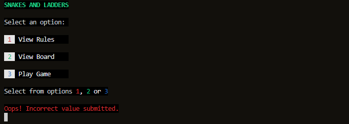

# Testing

Using the [flowchart](docs/wireframes/flowchart.png "Game logic flowchart") as a guide, an incremental approach was used to build the application.

## IDE tools
The problems tab beside the terminal in gitpod provided warnings for code issues.  There are a few categories. Those of primary concern were highlighted red and needed to be resolved.
This was consulted every after writing several lines of code and was especially useful for resolving syntax errors and checking for unused variables.

*Terminal output*


## Code Validation
Code readability and consistency was routinely checked by directly pasting into a [PEP8](http://pep8online.com/) linter.

Issues identified like those below could then be addressed using a clean as your go approach.


## Game setup

### Casting
Care was taken when accepting inputs from the user.  These default to a *string* so required converting to an *integer* format as they were to be used in a loop to create the validated number of players.

``` python
# Immediately convert string input from user to an integer
player_count = int(input("Enter number of players between 2 and 4:\n"))
```

``` python
for p in range(1, player_count + 1):
    if p == 1:
        print("player one")  # testing
        player_list.append("P1 red")
    elif p == 2:
```
In early development an issue was found when the user didn't enter a value and just keyed *return*.

As *no* value was passed to the application it crashed as it bypassed the `validate_player_count()` function.


*Terminal output*


This was resolved by placing the `input()` inside a `try` statement and using truth value testing.

An added advantage to doing this was to raise/handle an error should the user enter a number as text.  E.g. *four* instead *4*. 

``` python
try:
    # code to run regardless, it may throw an exception...
    player_count = int(input(
        "Enter number of players between 2 and 4:\n"))
        raise ValueError

    if not input:
        print(f"You entered {player_count} player(s). Try again...\n")
        ...
except ValueError as e:
# except - if an exception thrown, clear terminal and restart program
    print('No value or text value submitted')
    # print(e)  # testing
    clear()    # clear terminal
    main()  # restart program
```

The associated `except` clears the terminal then restarts the program.

Note the `import` from the `os` module to build the clear_terminal function.

``` python
from os import system, name

def clear_terminal():
    """
    clear the terminal.
    """
    os.system("cls") if name == "nt" else system("clear")
```

At this stage, all the user now sees when submiting no or invalid input is a warning `No value or text value submitted`. The program resets itself after a brief period of time by employing the `sleep(2)` method from the imported `time` module set to 2 seconds.  This is necessary to give the users an oppurtunity to review and understand the message.  

It's a confidence building experience as they don't see an application crash caused by an error or update too quiclkly..

### Validating player counts
Print statements using f strings provide human readible feedback from the terminal.  This is demonstrated when the user enters a value outside the *range* of players needed for the game.

``` python
def validate_player_count(player_count):
    """
    Check number of players supplied from game_setup() function
    is an integer >= 2 and <= 4
    """
    try:
        if player_count < 2 or player_count > 4:
            raise ValueError
    except ValueError:
        print(f"You entered {player_count} player(s). Try again...")
```

*Terminal output*


### Verifying an object was created for the assigned number of players
My current understanding of Python is that it is built from list, dictionary and class structures.  As such, my challenge for this project was to:
- build a list of players based on a validated number of players entered by the user
- populate that list with predetermined player/pawn color values. (This could easily have been an inputted name)
- using dictionary comprehension, build a dictionary based of the above list.  Each key corresponds to a list value. As I wanted to follow an OOP paradigm the corresponding dictionary *values* were to be *instances* of the *Player* class.
- each instance can be accessed by their respective *key iterable*.

NB. Multiple methods and attributes can be added to the class instance for improved versatility/future development.  For an MVP, only the `pawn_color` and `curr_position` attributes are present.  These can added to at need.

### The **Player** class
``` python
class Player:
    """
    Player class
    """

    def __init__(self, pawn_color, curr_position=0):
        # inst properties
        self.pawn_color = pawn_color
        self.curr_square = curr_position

    # inst methods
    def location(self):
        """
        return a statement representing this object's:
        (plan is to update the VALUE ingame with dice roll or landing on a \
        snake head/ladder foot to simulate player's current position)
        """
        player_location = {f"{self.pawn_color} pawn is on square \
        {self.curr_square} "}

        return player_location
```

Each object has it's unique place in memory (proving its instance).

*Terminal output*


## Game

### Considering data passing between functions
A conceptual leap I have made is to consider the structure of data that flows from one function to another.  Its must be compatible.  In this example, the game_setup() function returns a dictionary which is stored the *players* variable. By passing the players variable to the snl_game() function, we are providing the snl_game(players) function the dictionary generated by the game_setup() function.  Thus the player dictionary can now be manipulated within the snl_game() function.

``` python
players = game_setup()  # players = dict of players rtnd from game_setup()
snl_game(players)  # pass 'players' dictionary to the game
```

### Setting up an infinite loop between players
As this is a game of chance we do not know how many turns are needed for a player to win.
This requires an infinite loop which is set up using `while True:`.

NB. This isn't overly useful for debugging as you have to select *ctrl + c* simultaneously to stop.  As a computer is fast you can miss some important output on the terminal that is relevant to the debugging process.  

A solution is to comment out the infinite command using *ctrl + /* and replace with a loop that repeats several times only.

``` python
def snl_game(players):
"""
Iterate players, loop through each until win condition met
"""
# infinite loop needed to keep game live until victory condition met
# while True:
for i in range(1, 11):  # testing for 10 turns
```
*Terminal output*


### Testing for a player landing on a SNAKE_HEAD or a LADDER_FOOT
If ladder and snake functionality is working correctly, then movements on the board are greater than a six as per each dice roll.  This is evidenced using terminal output.

``` python
    if new_position in SNAKE_HEAD:
        new_position = SNAKE_HEAD[new_position]
        print(f"{player_ID} landed on a SNAKE_HEAD and moves to {new_position}")
    elif new_position in LADDER_FOOT:
        new_position = LADDER_FOOT[new_position]
        print(f"{player_ID} landed on a LADDER_FOOT and moves to {new_position}")
    return new_position
```

*SNAKE_HEAD proof from terminal output*


*LADDER_FOOT proof from terminal output*


The snake and ladder functionality overrides the basic move as the code lines are after `new_position = curr_position + roll_num`.  

If the current player's position value is checked against the SNAKE_HEAD or LADDER_FOOT dictionary.  If that value is equal to one already *in* the dictionary *'key'*, then the current position value becomes the *value* of the found key.

### Testing for first player reaching square 100
With the above game mechanics working, we now need to end the game when the first player sucessfully reaches square 100.
This is done by passing the current player object to the `check_win()` function in a inner loop for each player iteration.  If the win condition is met, the application terminates after declaring a winner. 

Note there is no need to return `False` from `check_win` to keep the game running.

``` python
def check_win(player_ID, player_inst):
    if player_inst.curr_square >= 100:
        print(f"Player '{player_ID}' wins!\n")
        exit()
    return False
```

*Terminal output*


### Simulating a dice roll and rolling a six for another turn
Simulating a roll fits neatly into its own `roll_dice()` function.

To get this to work the random module was imported into `run.py`. The `randint` method from this was used to return a random number from 1 to 6 to represent each side of a standard dice. This was saved into the `roll` variable.

To check if a player rolled a six, I envisaged another attribute in the Player class called `self.rolled_six = True`.
The value of the instance attribute could be changed truthy/falsy using a ternary expression taken from the `another_turn` variable.

**Unresolved Bug**

I opted to create the game without the **six roll** functionality due to a hard deadline. The code snippet has been retained on file for future use to summarise the issue and previous attempts to resolve.

A `while` loop was used as there is a chance that a six could be rolled consecutively.
The main issue was breaking out of the loop based upon the rolled_six attribute's value.
My current knowledge suggests a `while True` expresion always evaluates to true.

Review a useful article by [John Sturtz](https://realpython.com/python-while-loop/).

``` python
def roll_dice(player_inst):
    roll = random.randint(1, 6)
    # ternary expression to evaluate True or False
    another_turn = True if roll == 6 else False
    # assign bool value of another_turn variable to player_inst attribute
    player_inst.extra_roll = another_turn
    return roll
```

## Next steps
We now have a *text based simulation* of the game.  It could be useful to a developer or data scientist. The application however is intended to be **user centric**.

To help achieve this I developed a more refined wireframe.

 

It further conceptualised how the application should execute. It informed the developer:

- where the program should flow until *termination* 
- where to *display* information to the user
- offer the user a means to make *decisions* and branch the program
- error handle in places the user made an *input* to prevent a crash
- build functions to *process* the users choices

Note how this ties in with the legend in the diagram below.
The color palette and shapes make particular development tasks more obvious.


## User Centric Development Stage

### Welcome Screen
Early development was useful.  Similar code constructs to capture errors can be used to handle decision areas of the project and prevent crashing. 

``` python
    try:
        # code to run regardless, it may throw an exception...
        pre_game_choice = int(input(f"Select from options {Fore.RED}1{Fore.WHITE}, {Fore.GREEN}2 {Fore.WHITE}or {Fore.BLUE}3{Fore.WHITE}.\n"))
        if not input:
            raise ValueError

    except ValueError as e:
        # except - if exception thrown, clear terminal and restart application
        # capture nums out of range or text input
        print(f'{Fore.RED}{Back.BLACK}Oops! Incorrect value submitted')
        sleep()
        clear_terminal()  # clear terminal
        pre_game()  # restart program
```

#### Error handling

*Terminal output*

If an inputted value is not an *integer* value of *1*,*2* or *3*,  the program resets after displaying feedback for two seconds.
The *red* text color conveys a warning message to the user prior to reset.



Checking that branching works for our options within the IDE.


[Return to README.md](README.md)